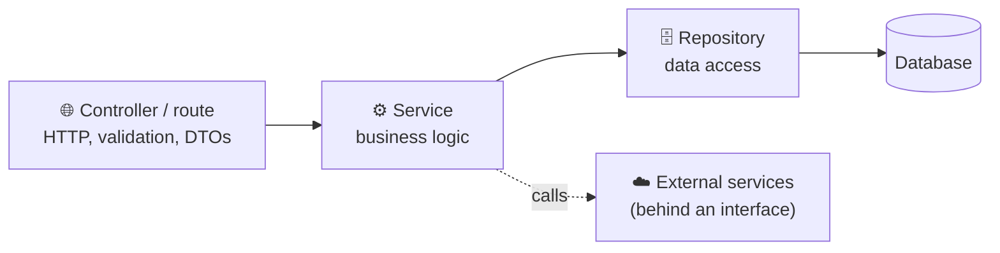
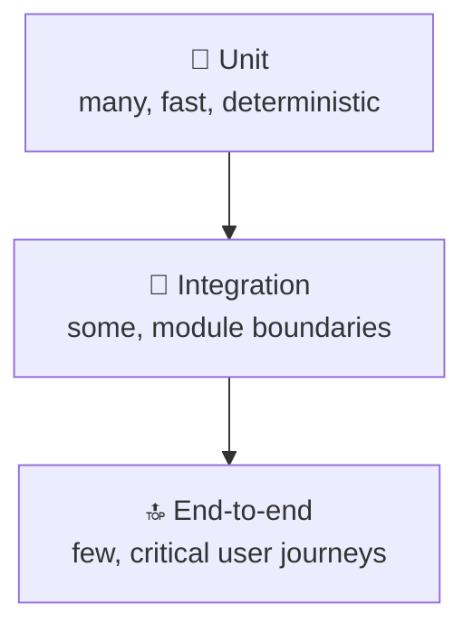

  

# Architecture Guidelines

These guidelines define the architectural principles and patterns used across TriNodes projects.

---

## 🧩 Core principles

- **Simplicity** — avoid unnecessary complexity
- **Modularity** — isolate responsibilities
- **Scalability** — design for growth
- **Maintainability** — prioritize readability and clarity
- **Security-first** — enforce secure defaults

---

## 🛠️ Backend architecture

- Use a layered architecture
- Separate controllers, services and repositories
- Keep business logic out of controllers
- Use DTOs for input and output
- Use dependency injection where applicable
- Follow consistent naming conventions

---

## 🎨 Frontend architecture

- Use a component-based architecture
- Keep components small and focused
- Use hooks for logic
- Use context sparingly
- Avoid global state unless necessary
- Follow accessibility standards (WCAG)

---

## 🔗 API architecture

- Use REST or GraphQL depending on the project
- Version endpoints
- Provide consistent error handling (a single error shape across the API)
- Use pagination for large datasets
- Document all endpoints (for example with OpenAPI)

---

## 🧪 Quality & testing

- Write tests for all business logic
- Maintain or increase coverage
- Use mocks for external services
- Ensure deterministic test behaviour

---

## 🔐 Security architecture

- Validate all inputs
- Sanitize outputs
- Use secure environment-variable handling
- Never store secrets in the repository or on developer machines — use a secret manager or the CI secret store
- Follow the [OWASP guidelines](https://owasp.org)

---

## 📝 Recording decisions

Significant architectural decisions should be captured as a short **Architecture Decision Record** (ADR) in the repository's `docs/adr/` folder: context, decision, consequences. This keeps the reasoning visible long after the discussion has ended.
