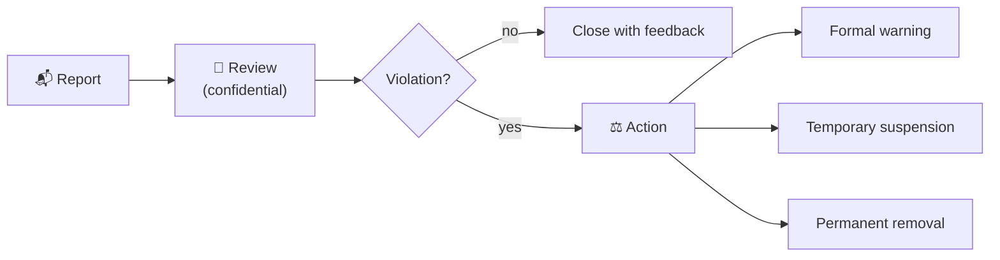

  

# Code of Conduct

TriNodes is committed to fostering a respectful, inclusive and professional environment for all contributors.

---

## 🌍 Our standards

### Expected behaviour
- Demonstrate professionalism and respect
- Use inclusive and clear language
- Accept constructive feedback
- Collaborate effectively
- Follow organizational standards and guidelines

### Unacceptable behaviour
- Harassment or discrimination
- Personal attacks or insults
- Sharing sensitive or private information
- Disruptive or hostile behaviour
- Intentional violation of security or governance rules

---

## 📍 Scope

This Code of Conduct applies in all TriNodes repositories, issues, pull requests, discussions and any other space where someone represents the organization.

---

## 🛠️ Enforcement

Violations may result in:

- A formal warning
- Temporary suspension from contributions
- Permanent removal from the organization
- Escalation to TriNodes leadership

---

## 📬 Reporting misconduct

To report unacceptable behaviour, write to **[conduct@trinodes.com](mailto:conduct@trinodes.com)**.

Reports are confidential and handled promptly. If the report concerns the person who would normally receive it, send it to **[contact@trinodes.com](mailto:contact@trinodes.com)** instead.

---

## 🙏 Commitment

By contributing to TriNodes, you agree to uphold this Code of Conduct.
