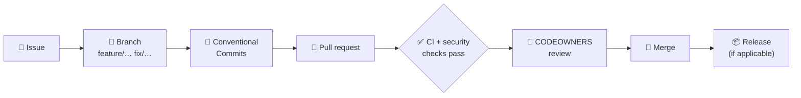

<p align="center">
  
</p>

# Contributing to TriNodes

Thank you for your interest in contributing to **TriNodes**. This guide explains how to open issues, submit pull requests and follow the development workflow shared by every repository in the organization.

> [!TIP]
> Each repository may add its own `CONTRIBUTING.md` with project-specific steps (setup, tests, scripts). When it exists, it takes precedence over this file.

---

## 🔁 Workflow at a glance



---

## 📝 Opening issues

Use the issue forms — they are loaded automatically when you click **New issue**.

| You want to… | Use |
|---|---|
| Report something that is broken | **Bug report** |
| Propose an improvement | **Feature request** |
| Track internal or maintenance work | **Task** |
| Ask for help or clarification | **Question** |
| Report a vulnerability | **Do not open an issue** — follow the [Security Policy](https://github.com/TriNodes/.github/blob/main/.github/SECURITY.md) |

Good issues describe the problem clearly, include reproduction steps, and link related issues or PRs. Labels are applied during triage; see [Standards → Labels](https://github.com/TriNodes/.github/blob/main/.github/STANDARDS.md#-5-labels).

---

## 🔀 Submitting pull requests

### 1. Create a branch with a consistent name

`feature/<name>` · `fix/<name>` · `hotfix/<name>` · `refactor/<name>` · `chore/<name>` · `docs/<name>`

### 2. Use Conventional Commits

```text
feat: add user authentication module
fix: resolve crash on login
docs: update API documentation
refactor: simplify the user service
chore: update dependencies
```

The pull request **title** is validated against the same convention. The full list of types is in [Standards](https://github.com/TriNodes/.github/blob/main/.github/STANDARDS.md#-1-commit-standards).

### 3. Make sure every check passes

- Lint
- Tests
- Build
- Security scan
- Commit and PR-title lint

### 4. Add the version-bump label (when applicable)

`bump:major` · `bump:minor` · `bump:patch` · `bump:build` · `bump:none`

### 5. Request review

Files are assigned to reviewers automatically through `CODEOWNERS`. Keep pull requests small and focused; do not mix unrelated changes or formatting-only changes with logic changes.

---

## 💻 Running projects locally

Every repository has a README with its own setup instructions. Always follow the project's README.

---

## 🔐 Security

Security problems **must not** be reported publicly. Follow the [Security Policy](https://github.com/TriNodes/.github/blob/main/.github/SECURITY.md).

---

## 🤝 Code of Conduct

By participating you agree to follow our [Code of Conduct](https://github.com/TriNodes/.github/blob/main/.github/CODE_OF_CONDUCT.md).
