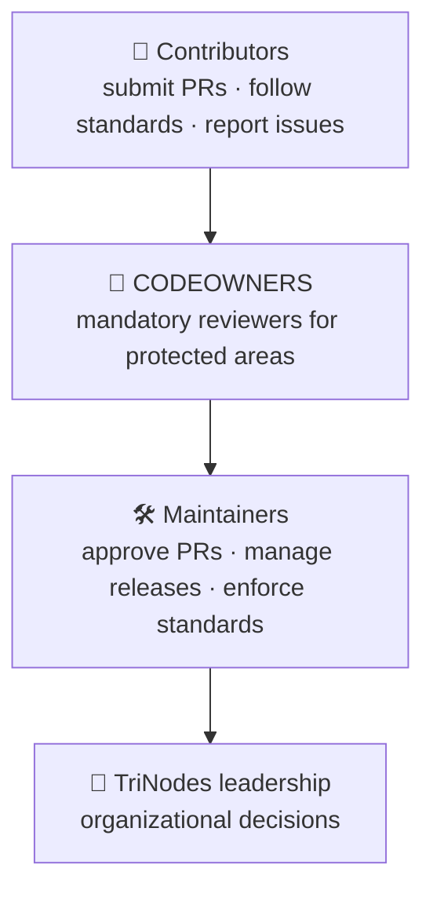
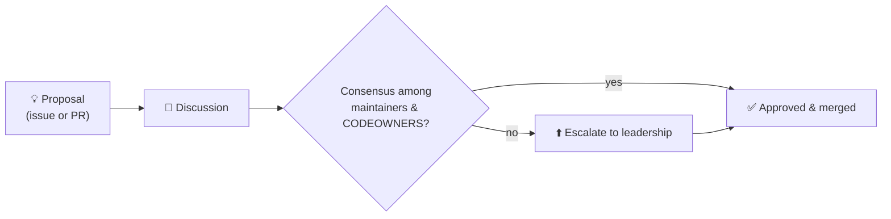

  

# TriNodes Governance Model

This document defines how decisions are made, how responsibilities are distributed and how standards are enforced across the TriNodes organization.

---

## 👥 Roles & responsibilities

### Maintainers
- Approve pull requests
- Manage releases
- Enforce standards
- Oversee repository health
- Coordinate with security and CI/CD owners

### CODEOWNERS
- Mandatory reviewers for protected areas
- Ensure architectural and coding consistency
- Validate compliance with standards

### Contributors
- Submit pull requests
- Follow the standards
- Participate in discussions
- Report issues responsibly

---

## 🧭 Decision-making process

- **Technical decisions** are made collaboratively by maintainers and CODEOWNERS.
- **Organizational decisions** are made by TriNodes leadership.
- **Dispute resolution** is handled through consensus among maintainers and escalated to leadership if necessary.

---

## 🚀 Release governance

- All releases follow [SemVer](https://semver.org)
- Pull requests must include a `bump:*` label (see [Standards](https://github.com/TriNodes/.github/blob/main/.github/STANDARDS.md#-4-semantic-versioning))
- Automated release workflows handle versioning, tagging and GitHub Releases
- Breaking changes require maintainer approval
- Release notes are generated automatically from the merged pull requests

---

## ⚙️ Workflow governance

- Repositories use the organization's reusable workflows instead of copying them
- Dangerous permissions (`contents: write`, `id-token: write`, `write-all`) require a written justification in the workflow file or the pull request that adds them
- The security suite must remain enabled
- CI/CD must pass before merging
- Branch protection (or a ruleset) must be enforced on the default branch

---

## 📘 Standards enforcement

All repositories must comply with:

- [Standards](https://github.com/TriNodes/.github/blob/main/.github/STANDARDS.md)
- [Contributing](https://github.com/TriNodes/.github/blob/main/.github/CONTRIBUTING.md)
- [Security Policy](https://github.com/TriNodes/.github/blob/main/.github/SECURITY.md)
- [Architecture Guidelines](https://github.com/TriNodes/.github/blob/main/.github/ARCHITECTURE_GUIDELINES.md)
- `CODEOWNERS` using real GitHub teams or users
- CI/CD requirements
- These governance rules

Compliance is audited weekly by the organization health check (`health-check.yml`).

---

## 📝 Amending this document

Changes to governance are proposed as a pull request, labelled `governance`, and require approval from TriNodes leadership in addition to CODEOWNERS.
