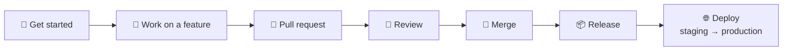

  

# TriNodes Developer Handbook

Welcome to TriNodes. This handbook provides guidance for contributors, maintainers and collaborators.

---

## 🚀 Getting started

1. Clone the repository
2. Install dependencies
3. Read the project README
4. Follow [CONTRIBUTING](https://github.com/TriNodes/.github/blob/main/.github/CONTRIBUTING.md)
5. Follow [STANDARDS](https://github.com/TriNodes/.github/blob/main/.github/STANDARDS.md)

---

## 🏗️ Creating a new repository

All new repositories must:

- Use a TriNodes template
- Call the required reusable workflows (CI, security, label sync)
- Include a `CODEOWNERS` file that uses real GitHub teams (for example `@TriNodes/it-development-team`)
- Include a `.github/dependabot.yml`
- Include documentation (README with setup instructions)
- Have secret scanning, push protection and branch protection enabled, wherever the GitHub plan supports them for that repository (see the [Security Policy](https://github.com/TriNodes/.github/blob/main/.github/SECURITY.md#-security-requirements-for-all-repositories))

See the [README](https://github.com/TriNodes/.github/blob/main/.github/README.md#-adopting-this-in-a-new-repository) for the step-by-step checklist.

---

## 🔧 Working on features

- Create a feature branch
- Follow the commit standards
- Write tests
- Open a pull request
- Request review from CODEOWNERS

---

## 📦 Release process

- Add the `bump:*` label to the pull request
- The release workflow bumps the version, tags it and publishes a GitHub Release with generated notes
- Maintainers approve major and minor releases
- Production deploys run behind the `production` environment, which can require manual approval

---

## 🔐 Security responsibilities

- Never commit secrets
- Follow the [Security Policy](https://github.com/TriNodes/.github/blob/main/.github/SECURITY.md)
- Report vulnerabilities privately
- Respect the [governance rules](https://github.com/TriNodes/.github/blob/main/.github/GOVERNANCE.md)

---

## 📬 Communication

- Use **issues** for questions, bugs and requests
- Use **pull requests** for changes
- Use **discussions** for ideas (where enabled)
