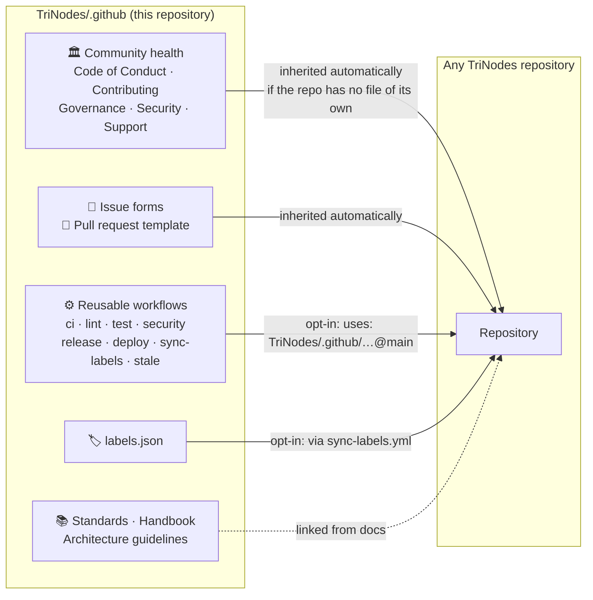
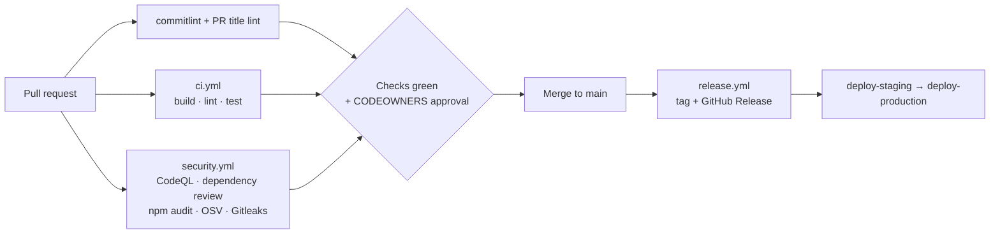

<p align="center">
  
</p>

# 🎛️ TriNodes GitHub Organization Configuration

> The single source of truth for community-health files, engineering standards and reusable CI/CD workflows used across every **TriNodes** repository.

**[Conventional Commits](https://www.conventionalcommits.org)** · **[SemVer](https://semver.org)** · **[Security Policy](https://github.com/TriNodes/.github/blob/main/.github/SECURITY.md)**

---

## 🧭 How this repository reaches the other repositories

Not everything here is applied the same way. GitHub **inherits** some files automatically, everything else is **opt-in** or **reference material**.



| Area | Files | Reaches other repositories… |
|---|---|---|
| 🏛️ Community health | `CODE_OF_CONDUCT.md`, `CONTRIBUTING.md`, `GOVERNANCE.md`, `SECURITY.md`, `SUPPORT.md` | **Automatically** (public and private repos) when the repo has no file of its own |
| 📝 Issue forms | `ISSUE_TEMPLATE/` (`bug_report`, `feature_request`, `task`, `question`, `config`) | **Automatically**, as long as the repo has no `ISSUE_TEMPLATE` folder of its own |
| 🔀 Pull request template | `pull_request_template.md` | **Automatically** |
| ⚙️ Reusable workflows | `workflows/*.yml` | **Opt-in** — each repo calls them with `uses:` |
| 🏷️ Labels | `labels.json` | **Opt-in** — through `sync-labels.yml` |
| 📚 Reference docs | `STANDARDS.md`, `HANDBOOK.md`, `ARCHITECTURE_GUIDELINES.md` | Read on GitHub; linked from the other documents |
| 👥 Code owners | `CODEOWNERS` | **This repository only** — GitHub does not inherit `CODEOWNERS` |
| 🏢 Organization profile | `profile/README.md` | Rendered on [github.com/TriNodes](https://github.com/TriNodes) |

> [!IMPORTANT]
> Workflows placed in this repository do **not** run in other repositories by themselves. A repository only gets them by calling them (see below). The same applies to `labels.json` and `dependabot.yml` — GitHub has no organization-wide default for either.

---

## ⚙️ Reusable workflows

Call them from any repository in the organization. Private repositories can call workflows stored in this public repository.

```yaml
# .github/workflows/ci.yml  (in the consuming repository)
name: CI

on:
  pull_request:
  push:
    branches: [main]

permissions:
  contents: read

jobs:
  ci:
    uses: TriNodes/.github/.github/workflows/ci.yml@main
    with:
      node_version: "22"
```

| Workflow | Purpose | Main inputs | Permissions the **caller** must grant |
|---|---|---|---|
| `ci.yml` | Install, build, lint and test (Node.js) | `node_version` | `contents: read` |
| `lint.yml` | `npm run lint` | `node_version` | `contents: read` |
| `test.yml` | `npm test` + upload of test results | `node_version` | `contents: read` |
| `security.yml` | CodeQL, dependency review, `npm audit`, OSV, Gitleaks, sensitive-file and workflow-permission scans | `languages`, `advanced_security`, `enable_osv`, `audit_level` | `contents: read`, `actions: read`, `security-events: write`, `issues: write` |
| `release.yml` | Version bump, tag and GitHub Release | `bump`, `node_version` | `contents: write` |
| `sync-labels.yml` | Sync `labels.json` and report orphan labels | `report_orphans` | `issues: write` |
| `deploy-staging.yml` | Build a static export and deploy over FTPS | `ftp_dir`, `output_dir`, `build_command`, `protocol` | `contents: read` + `FTP_*` secrets |
| `deploy-production.yml` | Same as staging, behind the `production` environment | same as staging | `contents: read` + `FTP_*` secrets |
| `stale.yml` | Warn, then close inactive issues and PRs | — | `issues: write`, `pull-requests: write` |
| `auto-label.yml` | Label PRs from changed paths (needs `.github/labeler.yml`) | — | `contents: read`, `pull-requests: write` |
| `commitlint.yml` | Validate commits against Conventional Commits | — | `contents: read` |
| `pr-title-lint.yml` | Validate the PR title against Conventional Commits | — | `pull-requests: read` |
| `auto-merge.yml` | Squash-merge PRs labelled `automerge` | — | `contents: write`, `pull-requests: write` |

Workflows that only run **in this repository**: `health-check.yml` (weekly organization audit) and `self-security.yml` (runs `security.yml` against this repo).

> [!NOTE]
> A called workflow can never receive more permissions than its caller grants. That is why `release.yml`, `security.yml` and others document the permissions the caller must declare.

---

## 🛡️ Security & governance



- **Security suite** — see [`security.yml`](workflows/security.yml). CodeQL and dependency review upload to *Code scanning*, which on **private** repositories requires GitHub Advanced Security; they are skipped there unless `advanced_security: true`. Dependency review also needs the **Dependency graph** enabled in the repository settings (Settings → Advanced Security).
- **Label governance** — `sync-labels.yml` keeps every repository aligned with [`labels.json`](labels.json) and opens one (deduplicated) issue when a repository has labels that are not in the catalogue.
- **Workflow governance** — the workflow-permissions scan flags missing `permissions:` blocks and `write-all`, and lists every `contents: write` / `id-token: write` so it can be justified (see [GOVERNANCE](GOVERNANCE.md)).
- **Organization health** — `health-check.yml` audits every repository weekly and keeps a single open `health-check` issue up to date.

---

## 🚀 Adopting this in a new repository

1. Create the repository from a TriNodes template (see the [Handbook](HANDBOOK.md)).
2. Add a `ci.yml`, `security.yml` and `sync-labels.yml` caller workflow (snippets above).
3. Add a `.github/dependabot.yml` and a `.github/CODEOWNERS` that uses real GitHub teams (for example `@TriNodes/it-development-team`).
4. Enable branch protection (or a ruleset) on `main`: required status checks, required CODEOWNERS review, no force-push. *Private repositories on the GitHub Free plan cannot use branch protection; in that case work through pull requests by convention.*
5. Enable secret scanning + push protection in the repository settings.

---

## 🔧 Maintaining this repository

- Every change goes through a pull request reviewed by [CODEOWNERS](CODEOWNERS).
- Consumers reference `@main`, so a merge here changes behaviour everywhere. Prefer small, backward-compatible changes and add new inputs with safe defaults.
- `health-check.yml` needs an optional `ORG_AUDIT_TOKEN` secret (a fine-grained token or GitHub App with read-only *Contents*, *Metadata* and *Administration* on the repositories to audit). Without it only public repositories are audited.

---

## 📖 Documents

| Document | Description |
|---|---|
| [Developer Handbook](HANDBOOK.md) | From first clone to production release |
| [Contributing](CONTRIBUTING.md) | How to open issues and pull requests |
| [Standards](STANDARDS.md) | Commits, branches, PRs, versions, labels |
| [Architecture Guidelines](ARCHITECTURE_GUIDELINES.md) | Shared engineering principles |
| [Governance](GOVERNANCE.md) | Roles, decisions, release and workflow rules |
| [Security Policy](SECURITY.md) | Private vulnerability reporting |
| [Support](SUPPORT.md) | Where to get help |
| [Code of Conduct](CODE_OF_CONDUCT.md) | Community expectations |
