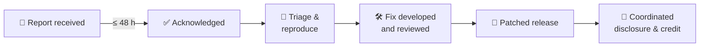

  

# Security Policy

TriNodes is committed to maintaining high security standards across all repositories.
This document explains how to report a vulnerability and how we handle reports.

---

## 🔒 Reporting a vulnerability

> [!CAUTION]
> - **Do not** open a public issue
> - **Do not** disclose the vulnerability publicly
> - **Do not** include sensitive details in pull requests or discussions

Report it privately to **[contact@trinodes.com](mailto:contact@trinodes.com)** with the subject `[SECURITY] <repository> – <short summary>`.
If the affected repository has GitHub **private vulnerability reporting** enabled, you can use the *Report a vulnerability* button on its **Security** tab instead.

Please include:

- A clear description of the vulnerability
- Steps to reproduce
- Potential impact
- Suggested remediation (optional)
- Relevant logs or screenshots (remove any real credentials or personal data)

---

## ⏱️ What happens next

We acknowledge every report within **48 hours** and keep you informed until the issue is resolved. Please give us reasonable time to release a fix before any public disclosure.

---

## 🔐 Supported versions

Security patches are applied to:

- The latest stable release
- Active LTS branches (if applicable)

---

## 🛡️ Security requirements for all repositories

All repositories must have:

- Secret scanning (with push protection) enabled
- Dependabot alerts enabled
- CodeQL analysis
- OSV scanning
- Gitleaks scanning
- Workflow-permissions scanning
- Sensitive-files scanning
- Branch protection (or a ruleset) on the default branch

> [!NOTE]
> Some of these features depend on the organization's GitHub plan: branch protection and rulesets, secret scanning, CodeQL and dependency review are not available on **private** repositories without the matching plan or GitHub Advanced Security. Where a feature is unavailable the `security.yml` workflow skips it, and the checks that do not need it (Gitleaks, OSV-Scanner, `npm audit`, sensitive-files and workflow-permissions scans) still apply.

The checks are provided by the reusable [`security.yml`](https://github.com/TriNodes/.github/blob/main/.github/workflows/security.yml) workflow and audited weekly by the organization health check. Security workflows **must not** be disabled.

---

## 🧩 Responsible disclosure

We follow industry-standard responsible-disclosure practices.
TriNodes does not offer bounties at this time, but we publicly acknowledge contributors who report valid vulnerabilities (unless you prefer to stay anonymous).
