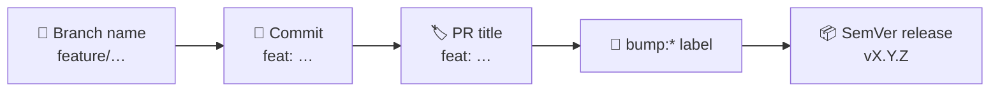

<p align="center">
  
</p>

# TriNodes Organization Standards

These standards apply to all repositories within the TriNodes GitHub organization.
They ensure consistency, quality, security and predictable workflows across all projects.



---

# 📌 1. Commit Standards

TriNodes follows the **[Conventional Commits](https://www.conventionalcommits.org)** specification:

| Type | Use for |
|---|---|
| `feat:` | A new feature |
| `fix:` | A bug fix |
| `docs:` | Documentation changes |
| `style:` | Formatting-only changes |
| `refactor:` | Code improvements without behaviour changes |
| `perf:` | Performance improvements |
| `test:` | Adding or updating tests |
| `build:` | Build system or external dependency changes |
| `ci:` | CI/CD related changes |
| `chore:` | Maintenance tasks, dependency updates |
| `revert:` | Reverting a previous commit |

Append `!` after the type (or add a `BREAKING CHANGE:` footer) for breaking changes: `feat!: remove legacy login endpoint`.

**Examples**

- `feat: add user authentication module`
- `fix: resolve crash on login`
- `chore: update dependencies`
- `docs: improve API documentation`

> The same convention is enforced on **pull request titles** (`pr-title-lint.yml`) and on **commits** (`commitlint.yml`).

---

# 📌 2. Branch Naming

Branches must follow a clear and predictable naming convention:

- `feature/<short-description>`
- `fix/<short-description>`
- `hotfix/<short-description>`
- `refactor/<short-description>`
- `chore/<short-description>`
- `docs/<short-description>`

**Examples**

- `feature/add-payment-flow`
- `fix/navbar-overflow`
- `refactor/user-service`

---

# 📌 3. Pull Request Requirements

All pull requests must:

- Provide a clear description of the change
- Reference related issues (if applicable)
- Include appropriate labels
- Pass all CI checks
- Receive approval from CODEOWNERS
- Follow commit and branch naming standards
- Include a version-bump label when applicable
- Avoid mixing unrelated changes
- Avoid mixing formatting-only changes with logic changes

---

# 📌 4. Semantic Versioning

TriNodes uses **[SemVer](https://semver.org)** across all Node-based projects:

| Label | Meaning | Typical commit |
|---|---|---|
| `bump:major` | Breaking changes | `feat!:` / `BREAKING CHANGE:` |
| `bump:minor` | New, backward-compatible features | `feat:` |
| `bump:patch` | Backward-compatible bug fixes | `fix:` |
| `bump:build` | Changes that do not affect runtime (CI, docs, configs) | `ci:` / `docs:` / `chore:` |
| `bump:none` | No version bump required | — |

Exactly one `bump:*` label should be on a pull request. The reusable [`release.yml`](https://github.com/TriNodes/.github/blob/main/.github/workflows/release.yml) workflow takes the bump level as an input (`patch` by default), so the calling repository maps the label to that input.

---

# 📌 5. Labels

[`labels.json`](https://github.com/TriNodes/.github/blob/main/.github/labels.json) is the single catalogue of organization-wide labels and is **mandatory** across all repositories. It is applied with the reusable `sync-labels.yml` workflow; labels that exist in a repository but not in the catalogue are reported as *orphans*.

### ✔ Core workflow labels
`bug` · `enhancement` · `dependencies` · `security` · `documentation` · `performance` · `tests` · `ci` · `governance` · `question` · `task`

### ✔ Version bump labels (SemVer)
`bump:major` · `bump:minor` · `bump:patch` · `bump:build` · `bump:none`

### ✔ Workflow automation labels
`needs-triage` · `needs-review` · `needs-testing` · `ready` · `blocked` · `stale` · `automerge` · `pinned` · `health-check`

### ✔ Priority labels
`priority:high` · `priority:medium` · `priority:low`

### ✔ Type labels
`type:feature` · `type:bug` · `type:refactor` · `type:docs` · `type:ci` · `type:design`

### ✔ Area labels *(optional but recommended)*
`area:frontend` · `area:backend` · `area:api` · `area:infra` · `area:ci` · `area:deployment`

### ✔ Community labels
`good first issue` · `help wanted` · `duplicate` · `invalid` · `wontfix`

### ✔ Dependency ecosystem labels *(added by Dependabot)*
`javascript` · `python`

### ✔ Client labels *(for multi-client repositories)*
`client:<name>` — created per repository and therefore **not** part of the catalogue. Add the pattern to the repository's own label policy if you use it.

---

### Applying labels automatically

```yaml
# .github/workflows/sync-labels.yml  (in the consuming repository)
name: Sync labels

on:
  workflow_dispatch:
  schedule:
    - cron: "0 6 * * 1" # Mondays at 06:00 UTC

permissions:
  contents: read
  issues: write

jobs:
  labels:
    uses: TriNodes/.github/.github/workflows/sync-labels.yml@main
```
