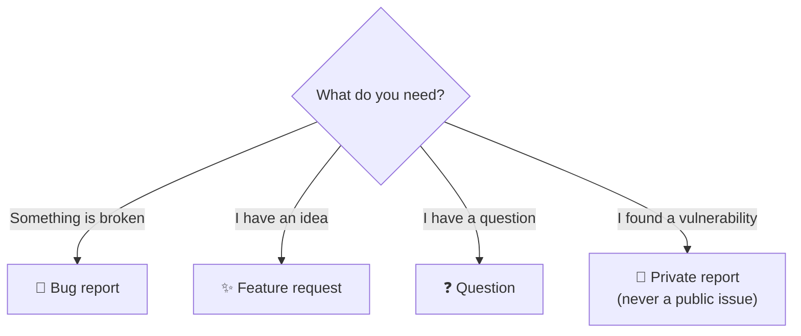

  

# Support

If you need help with any TriNodes repository, use the channel below that fits your situation. Choosing the right one gets you a faster answer and keeps triage consistent.

---

## ❓ Questions

For general questions, usage doubts or clarifications:

- Open a **Question** issue using the **Question** form
- Provide context and examples whenever possible

---

## 🐞 Bug reports

If you found a bug:

- Open a **Bug report** issue using the **Bug report** form
- Include reproduction steps
- Add screenshots or logs if relevant
- Specify environment details (OS, browser, version, …)

---

## ✨ Feature requests

For new ideas or improvements:

- Open a **Feature request** issue using the **Feature request** form
- Explain the motivation and the expected behaviour
- Include examples or mock-ups if helpful

---

## 🔐 Security issues

> [!CAUTION]
> Security vulnerabilities **must not** be reported publicly.

Follow the private reporting process described in the [Security Policy](https://github.com/TriNodes/.github/blob/main/.github/SECURITY.md).

---

## 📬 Other enquiries

For anything that is not a technical issue, contact us at **contact@trinodes.com** or visit [trinodes.com](https://www.trinodes.com/).
