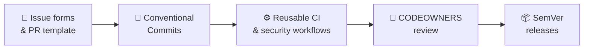

  

  
  

Welcome to the official **TriNodes** organization on GitHub.

We build modern web applications, automation tools and internal systems focused on performance, reliability and clean engineering practices.

---

## 🚀 What we do

- Production-ready applications
- Internal tools and automation
- Shared libraries and components
- CI/CD pipelines and reusable workflows
- Organization-wide standards and governance

Our goal is to deliver robust, scalable and maintainable solutions for real-world use.

---

## 📦 Repositories

Inside this organization you will find:

| | |
|---|---|
| 🖥️ **Applications** | Full production systems |
| 🔌 **Services & APIs** | Backend and integration layers |
| 📚 **Libraries** | Shared modules and utilities |
| 🏗️ **Infrastructure** | CI/CD, deployment and automation |
| 🧩 **Templates** | Reusable configs and workflows |

Each repository follows our internal standards for quality, documentation and collaboration.

---

## 🛠️ Engineering standards

Every repository adheres to the same baseline, defined in [`TriNodes/.github`](https://github.com/TriNodes/.github):

- [Contributing guide](https://github.com/TriNodes/.github/blob/main/.github/CONTRIBUTING.md)
- [Organization standards](https://github.com/TriNodes/.github/blob/main/.github/STANDARDS.md)
- [Security policy](https://github.com/TriNodes/.github/blob/main/.github/SECURITY.md)
- [Governance](https://github.com/TriNodes/.github/blob/main/.github/GOVERNANCE.md)
- [Developer handbook](https://github.com/TriNodes/.github/blob/main/.github/HANDBOOK.md)

---

## 👥 Team

<table>
  <tr>
    <td align="center"><a href="https://github.com/Dfmd"> @Dfmd</a></td>
    <td align="center"><a href="https://github.com/joseluisccosta"> @joseluisccosta</a></td>
    <td align="center"><a href="https://github.com/xandemoss"> @xandemoss</a></td>
  </tr>
</table>

We collaborate to build reliable software and maintain a strong engineering culture.

---

## 📬 Contact

For inquiries, reach us at **[contact@trinodes.com](mailto:contact@trinodes.com)**.
To report a security issue, please follow our [security policy](https://github.com/TriNodes/.github/blob/main/.github/SECURITY.md).
